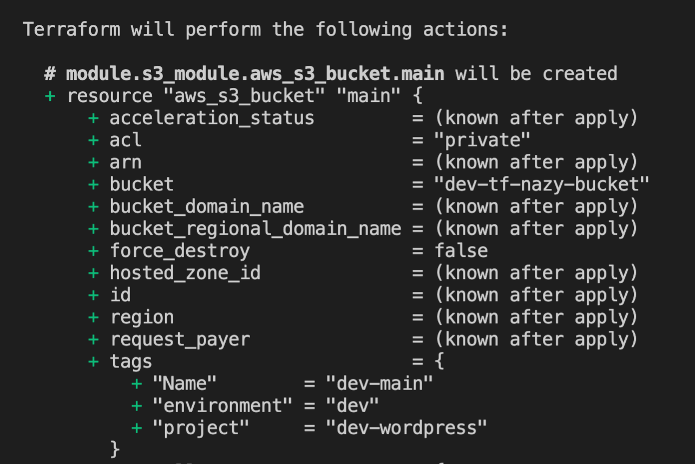
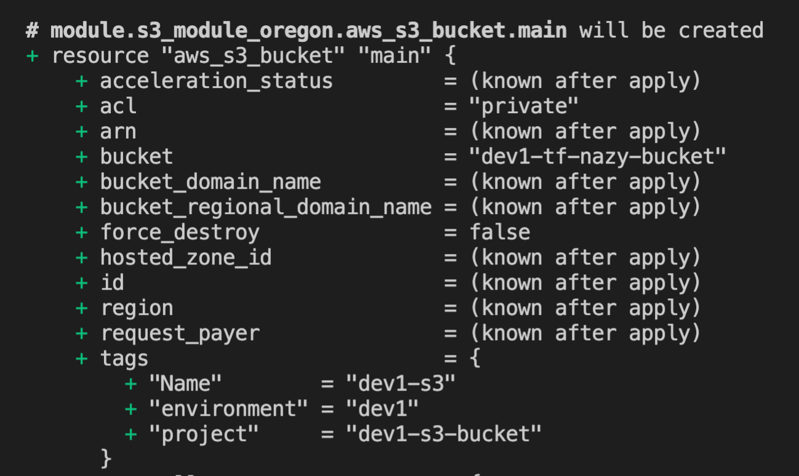

# Terraform modules. S3 example.

`Modules` are the main way to package and reuse resource configurations with Terraform. We consider a `module` as a container for multiple resources that are used together and when we want to build our infrastructure we call it as a ready template. That being said we don't have to build our configuration from the scratch. 

### Root module

The `root module` is directory where we call `child module` and consider it as a working directory, where we run terraform init, terraform plan and terraform apply.

```
module "s3_module" {
  # remote module
  source = "../../modules/s3"  # local module
  # variables in module
  env = "dev"
}
```

### Child module

`Child module` is where we store configuration files (templates) and it that can be called by other (root) modules. Unlike `root module` we don't run here any terraform commands, and we don't consider it as working directory.

```
resource "aws_s3_bucket" "main" {
  bucket = "${var.env}-tf-nazy-bucket"
  acl    = "private"

  tags = local.tags
}
```

### Remote module

Modules can be stored `locally` or `remotely`, depending on that source type in the root module will take either relative path to (child) module if it is stored locally or a link where child module is stored. According to terraform module can be stored in GitHub, Terraform Registry, Bitbucket etc.

local source type,
```
module "rds_module" {
  source =  "../../terraform_class/modules/ec2"
}
```

remote source type,
```
module "s3" {
  source =  "github.com/nazy67/terraform_class/modules/ec2"
}
```

In our case we have all our configurations in one folder `terraform_session`, ideally when we call a `child module` we call a repository, not a folder in a repository. Another thing to mention that when we call a module that is stored in GitHub we can also reference to a specific version of configurations (release version) or a branch in that case we have to just pass the following.

```
?ref=v0.2.0          - refering to tag version
?ref=nazy_branch     -  refering to branch
```

That is how you pull specific release version from a remote GitHub repository.

```
module "s3" {
  source =  "github.com/nazy67/terraform_class/modules/ec2?ref=v0.2.0"
}
```

## Providers within modules. `providers` meta-argument.

If you would like to deploy the same resource but in different region you use provider (alias) meta-argument. We will show it in the next example, to start with we add another `provider block` with `alias` to providers.tf file.

```
provider "aws" {
  region = "us-east-1"
}

provider = {
    alias = "oregon"
    region = "us-west-2"
}
```

In a `root module` we create another `module block` and add provider aliases.

```
module "s3_module_oregon" {
  # remote module
  source = "github.com/nazy67/terraform-session/modules/s3"
  # variables in module
  env = "dev1"
  
  provider = {
    aws = aws.oregon
   }
}
```

s3 resource in us-east-1,



s3 resource in us-west-2,



Since we are working with s3 bucket we have to make sure that the bucket name is unique globally and for that reason we added in the environment "dev1" to avoid duplication. That is why when we create a configuration file we have to think it through and make it reusable.

### Useful links:

[Creating Modules](https://www.terraform.io/docs/language/modules/develop/index.html)

[Standard Module Structure](https://www.terraform.io/docs/language/modules/develop/structure.html)

[Providers Within Modules](https://www.terraform.io/docs/language/modules/develop/providers.html)