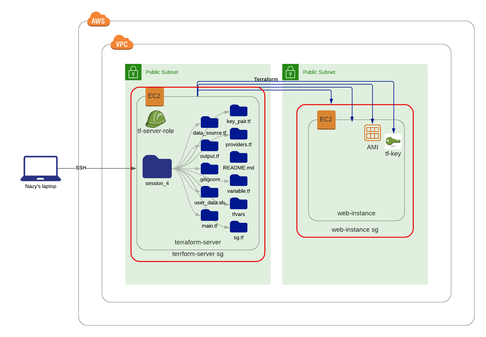

### Resources block

Resource blocks in terraform are the most important part Terraform, because every resource block describes the infrastructure that we want to provision, such as VPC, EC2 or DNS records. In a resource block we declare a resource of type ("aws_instance") with a name ("my_instance"), we also call them labels. This name is used to refer to this resource from inside of the same directory or call it from the parent module.

The resource type and name together serve as an identifier for a given resource and so must be unique.

Within the resource block we configure arguments for the resource itself such as resource type (aws_key_pair), and key_name is an argument that defined specifically for the aws_instance key_name.
```
key_name = aws_key_pair.tf_key.key_name
```

### Resource Types

#### Providers

Providers in terraform provides for example AWS offers a collection of resource types they usually provides resources for  AWS cloud or on-premises infrastructure platforms. Providers are distributed separately from Terraform itself, but Terraform can automatically install most providers when initializing a working directory. Terraform usually installs plugins based on a resource type's name. I providers file we can describe multiple configurations of a provider, when we want to create our resources  for example in a different region we must use meta-argument like ```alias``` from the provider configuration.

#### Meta-Arguments

The following meta-arguments are documented on separate pages:

- depends_on, for specifying hidden dependencies
- count, for creating multiple resource instances according to a count
- for_each, to create multiple instances according to a map, or set of strings
- provider, for selecting a non-default provider configuration
- lifecycle, for lifecycle customizations
- provisioner and connection, for taking extra actions after resource creation 
 
### Data source

Data sources allow us to fetch or retrive pre-existing data or computed for use in our configuration file. Data source will get the the existing the resource for us, for example ami id. In our main.tf we used data source to get ami from a region that we want to create our resources, instead of hard coding it, we made our code reusable by passing data source. To get a meta data about ami we want to use we can run the next command on cli.
```
    aws ec2 describe-images \
    --region us-east-1 \
    --image-ids ami-0742b4e673072066f
```

* hvm - means hardvare virtual machine

### What is format

Format is a string function, we can use this function in many cases for example:
```
  tags = {
    Name  = "${var.env}-instance"  # prefix example
    Name2 = format("%s-instance", var.env)  # suffix example
  }
```
In the example above we used the format function to get environment variable name, %s allows us to get a string.

### Notes 

-  By splitting our network into subnets, you can control the flow of traffic, subnets help us to improve out network performance and speed. (helps us to bring the internet)

- When you use only single bases we don't use variables file, when we create and manage our resources.

- tfstate file is where we can see desired state of our resources, all of it will be added to the state file.

- Resource names must start with a letter or underscore, and may contain only letters, digits, underscores, and dashes.

- Provider documentation used to be hosted directly on terraform.io, as part of Terraform's core documentation. Although some provider documentation might still be hosted here, the Terraform Registry is now the main home for all public provider docs.

- AMI is a regional resource, we use ami's depending on which region we want to create our EC2 resource.

### Diagram




### Useful links

[Resource Blocks](https://www.terraform.io/docs/language/resources/syntax.html)

[Data Sources](https://www.terraform.io/docs/language/data-sources/index.html)

[Format Function](https://www.terraform.io/docs/language/functions/format.html)
