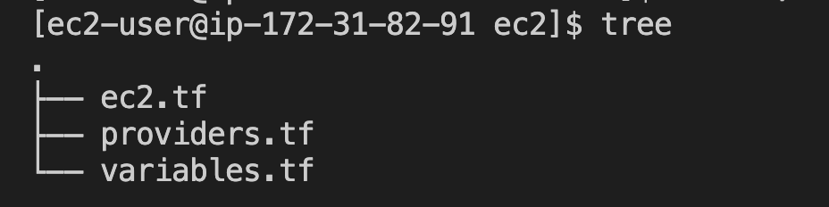
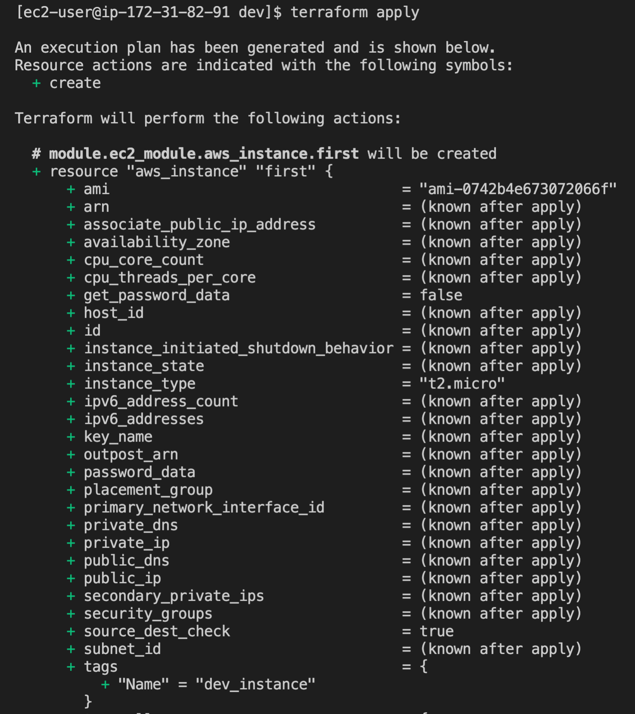
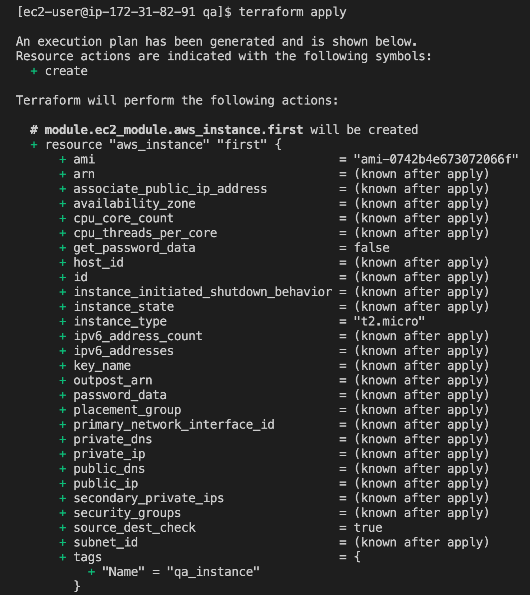
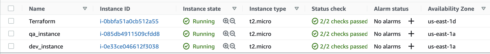

# Terraform modules. EC2 example.

In terraform using `folder structure` for environment isolation is great, but it has it's own downsides. For example, when you store your backend file remotely, each time when you provision your infra you have to modify your the name of your environment ("dev" or "qa") in backend.tf file since you can't pass variables or use interpolation for environment definition.

```
terraform {
  backend "s3" {
    bucket = "nazy-tf-bucket"
    key    = "session_9/dev/ec2.tfstate"   # here environment name has to be hardcoded
    region = "us-east-1"
  }
}
```

So what you do is modify backend.tf file for each environment, but before applying to different environment you need to remove `.terraform` folder (because contains terraform.tfstate file inside of it) and `teffaform.lock.hcl` files from the working directory, after that run terraform init again to initialize the working directory. For destroying you have to do it all over again and it becomes pretty complicated to manage (too many configuration files and folders, can get confusing really fast). For that purpose using module comes really handy, the same `child module` can be called for different environments. Instead of trying to keep track of every file in environment isolated folders, you just manage one configuration folder (that we call child module) and call it as many time as you need. 

In our example ec2 `child module` contains:



Having providers.tf file in a child module is good practice because when you call that module you want to make sure `terraform version` in a `root module` is compitable with `terraform version` in `child module`, otherwise your code could break, especially if you are trying to call child module which was written in older version of terraform from the root module with the latest version of terraform.

```
terraform {
  required_version = "~>0.14.0"  # version of Terraform
  required_providers {
    aws = {
      source  = "hashicorp/aws"
      version = "~>3.38.0"
    }
  }
}
```

The example with ec2 is very simple, doesn't have many variables to define, when you call a module the values fo variables defined in child module needs to be passed in a root module as it shown below,

ec2.tf child module
```
resource "aws_instance" "first" {
  ami           = var.ami
  instance_type = var.instance_type

  tags = {
    Name = "${var.env}_instance"
  }
}
```

variables.tf child module,

```
variable "ami" {
  type = string
}

variable "instance_type" {
  type = string 
}

variable "env" {
  type = string
}
```

main.tf root module,

```
module "ec2_module" {
  # local module
  source = "../../modules/ec2"
  
  # variables in module
  env           = "dev"                    # can to be changed to "qa" or any other environment
  instance_type = "t2.micro"
  ami           = "ami-0742b4e673072066f"  # us-east-1 AMI
}
```
ec2 in dev environment, after running terraform apply,



ec2 in qa environment after running terraform apply,



this is how it looks on AWS console



#### Tips and tricks

For copying contain of the folder from one to another the next command becomes very useful. This command will ignore hidden files and copies the rest of the files to new folder.

```
cp -avP dev/* qa/    
```
- `a`  archive (same as -dR --preserve=all)
- `v`  verbose  (explain what is being done)
- `P`  no-dereference (never follow symbolic links in SOURCE)

## Useful links:

[Modules](https://www.terraform.io/docs/language/modules/index.html)

[Module Blocks](https://www.terraform.io/docs/language/modules/syntax.html)

[Module Sources](https://www.terraform.io/docs/language/modules/sources.html)