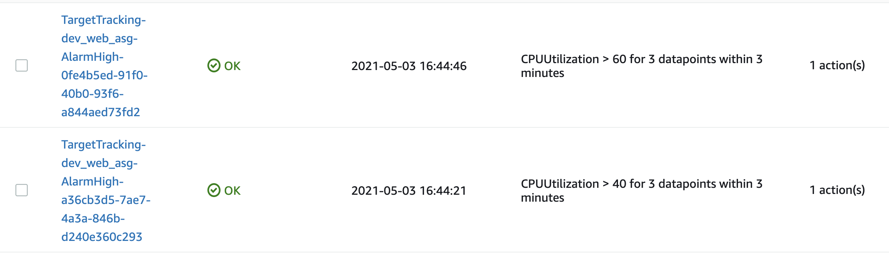

## Terraform project Wordpress (frontend)

This project will cover the ```frontend``` of application which is user interface, while ```backend``` means the database-server, application and database that work behind the scenes to deliver information to the customers. Our state file will be stored in S3 bucket as we configured in backend.tf file, it is common to store your state file remotely when you work with a team. This Project contains cofiguration files of resources:

### Networking

- VPC
- 3 Public and Private Subnets
- Elastic IP 
- Nat Gateway
- Internet Gateway
- Route table association (public/private)

### Security Groups

- Application Load Balancer Security Group 
- Web-server Security Group For Launch configuration

#### Application Load Balancer

- Application Load Balancer
- Target Group:
  - HTTP Listener
  - HTTPS Listener

### Application

- Launch Template
- Auto Scaling Group
- Target tracking scaling policy (scale in/out).

### DNS

- ACM Certification (Data source)
- Route 53 record

### Description

- VPC

We a creating our own VPC, it is configured with `count` meta-argument combined with `element`, `lenght`, `index`  functions, for tags locals and `merge` were used. When we have similar resources such as public/private subnets and public/private route table associations we can use `count` to avoid repeating the similar resources. With one public/private subnet resource block we are able to provision three public/private subnets and instead of repeating the route table association three times we cofigured it with one resource block. In tfvars/dev.tf we used list(strings) value type for passing the values of attributes. If you would like to learn more about different configuration of VPC check here [terraform_vpc_examples](https://github.com/nazy67/terraform_vpc_examples).

- Security Groups

1. Application Load Balancer Security Group. We have two ingress rules HTTP (80) and HTTPS (443) open to the world (0.0.0.0/0), and egress rule with `-1` protocol which means everything to 0.0.0.0/0. In Terraform we have to specify egress rule, if not Terraform will not create it. 
2. Web-server Security Group For Launch configuration,  HTTP port open to 0.0.0.0/0 as well as egress rule.

- Application Load Balancer

Application Load Balancer was configured with Target Group and Listeners rules 80(redirected to 443) and 443 (fowarded to target group). It's internet facing (we want our website to be available to users) and Target group has a health check if, the health of our instances will fail ASG will add a new instance. For the Litener rule 443 we attached our existing `ACM Certificate` that we fetched in in a acm.tf file. 
```
data "aws_acm_certificate" "my_certificate" {
  domain   = "nazydaisy.com"
  statuses = ["ISSUED"]
}
```

- Launch Template and Auto Scaling Group

We configured Launch Template first as part of Auto Scaling Group, it will be  created with ```amazon linux 2``` image id, which data source fetched from Amazon since it's existion resource.  And Launch Template has user_data.sh script, which installs enables and starts Apache, and has a very simple index.html file with greeting in our website. In Auto Scaling Group we specified that we want our instances to be on private subnets (it has elastic IP), otherwise we have to associate public IP address if instances in public subnets. The last resource blockd in Auto Scaling Group is attachment of ASG to ALB (through Target group), and ALB will provide the traffic to Private Subnets where our targeted Instances are sitting.
ASG has a different way of tagging, it requres map of tags, but with the help of  dynamic block we creted tags this way,
```
  tag {
    key                 = "Name"
    value               = "${var.env}_web_server"
    propagate_at_launch = true
  }

  dynamic "tag" {
    for_each = local.common_tags

    content {
      key                 = tag.key
      value               = tag.value
      propagate_at_launch = true
    }
  }
```
If you want to read about it more check out [Dynamic tagging](https://www.hashicorp.com/blog/hashicorp-terraform-0-12-preview-for-and-for-each).

- Target tracking scaling policy (scale in/out).

AWS strongly recommends to use a Target tracking scaling policy to scale on a metric like average CPU utilization or the RequestCountPerTarget metric from the Application Load Balancer. With target tracking policy AWS will create and manage cloudwatch alarm. [Target tracking scaling policies for Amazon EC2 Auto Scaling](https://docs.aws.amazon.com/autoscaling/ec2/userguide/as-scaling-target-tracking.html)



- Route 53 record.

"A" (IPv4 and some AWS resources) type Route 53 record was created which will route traffic to alias Application Load Balancer with `Simple routing policy`. For that we fetched an existing zone name in data_source.tf and we were able to get zone_id from it, keep in mind that in AWS zone name always ends with `.` like `nazydaisy.com.`.
```
data "aws_route53_zone" "my_zone" {
  name = var.zone_name
}
```

### Notes

- You may want to omit desired capacity attribute from attached aws autoscaling group when using autoscaling policies. It's good practice to pick either manual or dynamic (policy-based) scaling. [Omit desired capacity](https://registry.terraform.io/providers/hashicorp/aws/latest/docs/resources/autoscaling_policy)